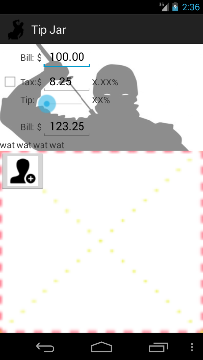

# TipJar Ninja

TipJar Ninja is an application which helps you with splitting the bill
at a restaurant.  Ever been out to eat, and one big bill/check comes,
and you need to split it, while letting some people pay extra for
their extra side(s)/drink(s) (or maybe they had one fewer drink than
most folk), pick up other people's checks, and deal with people who
put down cash?

This program is distributed in the hope that it will be useful,
but WITHOUT ANY WARRANTY; without even the implied warranty of
MERCHANTABILITY or FITNESS FOR A PARTICULAR PURPOSE.  See the
GNU Lesser General Public License for more details.

## Project Statistics

So far, approximately 8 hours of development time has been spent on
this application.

## Author and License

Copyright (c) 2014, Sam Vilain.  All Rights Reserved.  This program is
Free Software; you can use it and/or modify it under the terms of the
[Lesser GNU Public License (LGPL) version 3.0](https://www.gnu.org/licenses/lgpl.html),
or, at your option, any later version.

You should have received a copy of the Lesser GNU General Public
License along with this program.  If not, see <http://www.gnu.org/licenses/>.
